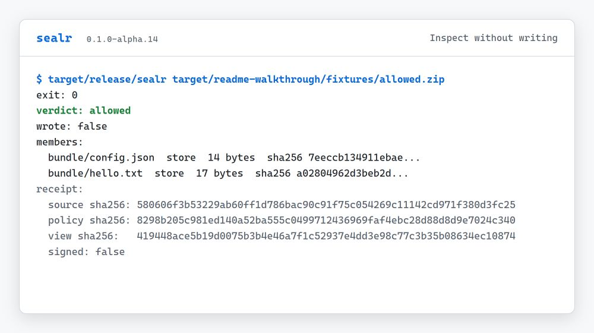
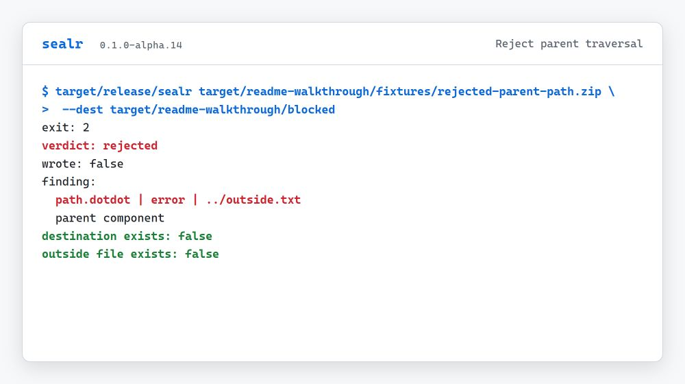
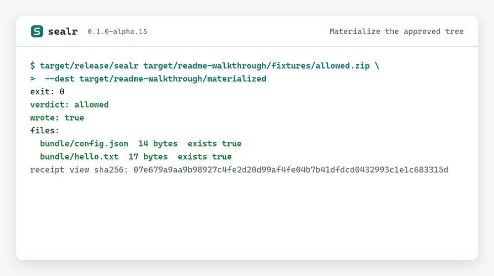

# sealr

[](https://github.com/blisspixel/sealr/actions/workflows/ci.yml)

> **Sealr turns an untrusted archive into one verified, reusable tree capability — or nothing.**
>
> One archive. One meaning. One verified tree.

Different parsers routinely assign different meanings to the same archive bytes, and real attacks exploit exactly that disagreement. Sealr admits an archive through exactly one versioned, fail-closed interpretation, verifies every member, and hands downstream code an opaque `VerifiedArchive` capability plus an evidence receipt. Downstream consumers use the capability and never reopen the archive; the original file can be deleted the moment admission completes. If any byte fails verification, there is no tree at all.

```text
Untrusted archive x policy
  -> (Allowed { wrote } | Rejected) x receipt x inspectable view
```

## Thirty seconds

```text
git clone https://github.com/blisspixel/sealr.git && cd sealr

# Inspect: view JSON on stdout, receipt JSON on stderr, no files written.
cargo run --locked -p sealr-cli -- path/to/archive.zip

# Materialize into a new destination below an existing parent — or nothing.
cargo run --locked -p sealr-cli -- path/to/archive.zip --dest ./out

# Real-world release zips are usually ZIP64; select that profile explicitly.
# (The default is deliberately narrow ZIP32; a ZIP64 archive rejects with
# zip.diff.c5_zip64 until you select it — that is the finding telling you which
# door to use, not the tool failing.)
cargo run --locked -p sealr-cli -- path/to/archive.zip --format zip64 --dest ./out

# Capture both evidence documents as files.
cargo run --locked -p sealr-cli -- path/to/archive.zip --view v.json --receipt r.json

# Capture byte-exact RFC 8785 evidence, then verify it against the archive.
cargo run --locked -p sealr-cli -- path/to/archive.zip \
  --view v.json --receipt r.json --canonical
cargo run --locked -p sealr-identity-verifier -- evidence \
  --view v.json --receipt r.json --source path/to/archive.zip
```

Exit `0` means admitted and completely verified; `2` means not admitted; `3` means admitted but the destination effect failed. Every path emits the view and the receipt.

## Twenty lines of Rust

A downstream consumer that installs a Python wheel from the capability alone — the source file is gone before evaluation begins:

```rust
use sealr::wheel::{evaluate_wheel, WheelEvaluation, WheelLimits};
use sealr::{apply_with_options, ApplyOptions, Policy, Request, Source, ZipInterpretationProfile};

fn main() {
    let policy = Policy::default_v1();
    let options = ApplyOptions::new()
        .with_interpretation_profile(ZipInterpretationProfile::PortableUtf8V1);
    let request = Request {
        source: Source::Path("demo-1.0-py3-none-any.whl".as_ref()),
        policy: &policy,
        dest: None,
    };
    let outcome = apply_with_options(request, &options);
    let archive = outcome.verified_archive().expect("admitted").clone();
    std::fs::remove_file("demo-1.0-py3-none-any.whl").expect("capability outlives the file");
    match evaluate_wheel("demo-1.0-py3-none-any.whl", &archive, WheelLimits::default()) {
        WheelEvaluation::Admitted { plan, identities, .. } => {
            println!("{} planned entries, artifact {}", plan.entries().len(), identities.artifact_sha256);
        }
        other => println!("refused: {other:?}"),
    }
}
```

The complete runnable version — including a hostile `..` container refused before any capability exists and an admitted container whose lying `RECORD` is denied with an exact finding — is `cargo run --locked -p sealr --example wheel_admission`. A second example, `cargo run --locked -p sealr --example same_digest_different_tree`, turns the archive-confusion research into a capability-path artifact: one archive digest, an identical archive tree under two filenames, distinct filename-bound identities, and a typed refusal for a third — [the write-up](docs/same-digest-different-tree.md) explains why same digest is not same tree.

## Non-goals

- **Not malware detection.** Admission verdicts are structural and semantic. An admitted archive is one whose bytes carry exactly one meaning under the selected profile, not a safe program.
- **Not a general process sandbox.** The explicit x86_64 Linux worker is a reduced-authority boundary for selected operations, not host containment.
- **Not a 7-Zip or libarchive replacement.** Sealr is deliberately narrow: unsupported structure fails closed by design, and general-compatibility extraction is explicitly out of scope.
- **Not production-grade yet.** There is no external security audit, receipts are unsigned, and the limitations below are security boundaries, not fine print.
- **Not chasing format breadth.** Parser breadth is currently frozen; the active milestones are downstream usefulness, measured compatibility, and independent review. See the [near-term execution plan](docs/near-term.md).

The longer-term aim is an archive-to-tree admission boundary whose decision and evidence can be reused by other systems. Usefulness is not “more unzip.” It is: same bytes and policy produce one tree or no tree on Linux, macOS, and Windows, and the next tool consumes that tree instead of opening the ZIP again. The [usefulness test](docs/usefulness.md) is the quality bar.

> Status: `v0.1.0-alpha.11` is the eleventh development preview of the archive boundary. It is useful for evaluation, development, and adversarial testing. It is not ready to protect a production host from arbitrary hostile archives. Alpha.11 implements deliberately narrow ZIP32, explicit strict ZIP64, raw portable ustar, strict single-member gzip-wrapped portable ustar, and restricted raw POSIX PAX paths. Every nondefault format is selected explicitly and does not widen or alias the ZIP32 compatibility default. An explicit x86_64 Linux mode moves supported ZIP32 payload verification, stage writes, and later non-retained reads into an authenticated worker restricted with Landlock ABI 3 and seccomp, while the supervisor retains structural planning and publication authority; unsupported worker selections never fall back to in-process execution.

> Release contents: Alpha.11 adds the explicitly selected, zero-new-dependency `sealr.profile.tar.pax-portable.v1` restricted raw POSIX PAX preview under policy v5. It accepts only bounded local and global `path` and `size` records over exact portable-ustar physical headers, records precedence and provenance in `sealr.archive-ir.tar-pax.v1`, independently audits the source covering and state replay, binds layout through `sealrTreeV5` with label `sealr.tree.layout.tar-pax.v1`, and adds a dedicated nine-seed bounded scheduled fuzz campaign. It preserves Alpha.10 strict ZIP64 and gzip-TAR, Alpha.9 raw ustar, every earlier ZIP and wheel identity, and the Alpha.6 supervised Linux boundary. The [Alpha.11 release notes](docs/releases/v0.1.0-alpha.11.md) define the shipped delta and remaining limitations.

> Current main additionally implements seven unreleased previews: the restricted raw old-GNU long-name profile under policy v6 with `sealrTreeV6`, the gzip-wrapped restricted PAX and GNU long-name compositions under policy v7 with `sealrTreeV7` and `sealrTreeV8` (all zero-new-dependency), three executed Gate B codec promotions — the zstd-wrapped portable ustar profile under policy v8 with `sealrTreeV9` (`ruzstd` + `twox-hash`), the xz-wrapped portable ustar profile under policy v9 with `sealrTreeV10` (`lzma-rust2`, compiled under `forbid(unsafe_code)`), and the bzip2-wrapped portable ustar profile under policy v10 with `sealrTreeV11` (`bzip2` + the audited pure-Rust `libbz2-rs-sys`) — and the executed Gate C first step: the raw-header Copy-only 7z container under policy v11 with `sealrTreeV12` and zero new dependencies, which proves cross-container content parity for the first time. Each profile publishes a distinct layout identity while preserving the format-neutral content root and is refused by the authenticated worker without fallback.

## Why this exists

Agents, package systems, upload handlers, and data pipelines routinely receive archives from outside their trust boundary. Archive formats encode filesystem topology as well as content, and different parsers can assign different meanings to the same bytes.

The 2025 ZipDiff study compared 50 ZIP parsers across 19 languages, found that almost every parser pair disagreed somewhere, and classified 14 ambiguity types. Its public artifact includes constructors for those cases. A 2025 `uv` advisory then documented that one wheel digest could expand differently across installers, and PyPI added upload-time rejection for several ambiguous ZIP structures. These results motivate testing parser agreement instead of assuming it.

sealr therefore has one operation:

```rust
pub fn apply(request: Request<'_>) -> Outcome
```

Every outcome contains:

- an allow or reject verdict;
- a structured view of the interpretation;
- a receipt binding the available source digest, policy, view, tool, and environment;
- publication of the requested destination only after every member and the complete archive pass.

## Current implementation boundary

Alpha.11 supports classic ZIP32 archives with stored or Deflate members, strict ZIP64 under policy v3, raw portable POSIX ustar under policy v2, strict single-member gzip-wrapped portable ustar under policy v4, and restricted raw POSIX PAX under policy v5. Every nondefault format is explicit and in process. `apply()` and the `zip` CLI selection remain ZIP32 and never alias to another profile.

- CD-first parsing with exact EOCD, central-directory, local-header, and data-descriptor agreement.
- Rejection of hidden stream records, unreferenced layout bytes, overlapping records, spanned archives, traditional or strong encryption indicators, masked headers, unsupported methods, and mismatched flags or metadata. Every ZIP32 profile rejects ZIP64 markers rather than treating them as an alternate encoding of the ZIP32 selection.
- Pure lexical path jailing for absolute paths, parent traversal, ADS colons, reserved Windows names, trailing dots and spaces, control characters, empty components, depth, duplicates, case-fold collisions, and file/directory topology conflicts.
- Strict filename handling. The compatibility default accepts either ASCII names or explicitly flagged strict UTF-8 names, while strict ASCII v2 rejects non-ASCII. The opt-in [portable UTF-8 profile](docs/profiles/zip-portable-utf8-v1.md) requires strict UTF-8, NFC, explicit non-ASCII flagging, closed flags and extras, a pinned Unicode repertoire and full case-fold relation, and fixed component bounds. Unflagged non-ASCII and legacy CP437 names remain unsupported rather than guessed.
- An explicitly selected [portable POSIX ustar profile](docs/profiles/tar-ustar-portable-v1.md). It adds no runtime dependency, accepts only regular files and directories under the same portable UTF-8 path contract, validates exact header checksums, octal fields, member padding, two-block termination, and trailing record padding, and reuses the existing quota, verification, retention, read, and atomic materialization core.
- An explicitly selected [gzip-wrapped portable ustar profile](docs/profiles/tar-gzip-ustar-portable-v1.md). It reuses the existing `flate2` boundary and adds no dependency. The exact caller-supplied gzip bytes remain source domain 0; one bounded, immutable decoded TAR is retained as domain 1. Policy v4 separately caps the original and derived archives. Wrapper and TAR coverings, one exact transform record, CRC32, ISIZE, SHA-256, payload plans, and `sealrTreeV4` layout evidence bind the two domains before any destination stage is created.
- An explicitly selected [restricted POSIX PAX profile](docs/profiles/tar-pax-portable-v1.md). `--format tar-pax`, `ArchiveSelection::TarPax`, and policy v5 invoke exactly one raw parser with no retry or fallback. The language admits only canonical `x` and `g` extension payloads containing one or two exact `path` or `size` records. It caps each extension at 64 KiB and the archive at 1,024 extensions, preserves the underlying ustar values, records global, local, or ustar provenance for every effective field, independently replays the covering and state machine, and publishes `sealrTreeV5`. Links, sparse files, GNU records, base-256 numbers, unknown keywords, timestamps, ownership fields, mixed dialects, and recovery behavior remain denied. This path adds no runtime dependency.
- An opt-in [strict ASCII ZIP32 v2 profile](docs/profiles/zip-strict-ascii-v2.md) with an exhaustive 16-bit flag table and an all-extra-fields-denied rule. `apply()` preserves v1 compatibility; `apply_with_options` records the selected profile in IR and receipt identity.
- An explicit [strict ASCII ZIP64 v1 profile](docs/profiles/zip64-strict-ascii-v1.md). It uses policy v3, ZIP64-native IR evidence, an independent covering audit, and `sealrTreeV3` layout identity. It is available only in process: an authenticated worker request fails closed until semantic-record v3 can represent this evidence.
- Bounded source reads, metadata, file count, declared and actual member size, total expanded size, and declared and actual compression ratio.
- Checked `u64` snapshot access for magic detection, ZIP discovery, local and central metadata, covering audit, and payload verification. Path inputs are opened once, copied and hashed through a fixed 64 KiB buffer into a random private directory, reopened read-only, unlinked before ingest returns, and then served with positional reads. Caller byte slices remain memory-backed. Structural scratch reads are fixed-size or metadata-capped, and compressed member ranges stream through fixed 64 KiB buffers.
- Streaming Deflate, exact compressed-input consumption, CRC32, and SHA-256 calculation without buffering an expanded member in memory. The staged-tree audit also hashes through a fixed 64 KiB buffer. Trailing bytes and concatenated raw DEFLATE streams inside one declared member payload are rejected.
- Component-bound, same-volume staging with 128-bit random names. Every member component is opened no-follow from a retained directory handle, files use create-new handles, and the requested destination is published with native no-replace semantics only after every member passes.
- Deterministic JSON view and versioned unsigned receipt on allow and reject paths. Receipts record the materializer backend, stage mode, stage-creation primitive, component-resolution guarantee, durability, publication primitive, outcome, and cleanup state.
- Fully verified admitted outcomes expose an opaque `VerifiedArchive`. Callers may use `apply_with_options` to select a small exact-path set for independently capped retention during the original verification pass. Retained bytes can be borrowed without another parse, inflation, allocation, or hash; unretained reads remain caller-bounded and revalidate size, CRC32, and SHA-256 from the recorded payload range. See the [API contract](docs/api.md#bounded-one-pass-retention).
- A pinned 5,927-file, 14-class ZipDiff construction gate with a deterministically generated aggregate corpus digest, exact finding-count expectations, and an explicit 73-file control allowlist.
- An adversarial unit suite, an external-crate API fixture, a separate consumer that runs against the extracted packaged crate and exercises supervised ZIP plus in-process portable ustar, strict Clippy, rustfmt, documentation checks, cross-platform tests, and cargo-deny policy in CI.
- Versioned identity-conformance bundles for ZIP32, strict ZIP64, raw portable ustar, gzip-wrapped portable ustar, and restricted raw PAX. Production APIs pin every family. The standalone workspace verifier independently reconstructs the profile and tree encodings without depending on the Sealr crate. It validates source-bound ZIP and gzip wrapper geometry without record discovery or inflation, validates declared TAR geometry, PAX extension state and provenance, and derived-byte integrity, and reconstructs the published layout and content roots.
- Exact portable ustar fixtures from GNU tar 1.35, bsdtar 3.8.4, and Python 3.12.10, a codec-free TAR covering oracle that independently rescans all zero padding, native packaged-CLI inspect and materialization checks on all three release platforms, and a dedicated bounded checksum-aware TAR fuzz campaign with 15 exact starting states.
- A dedicated bounded restricted-PAX fuzz target with nine digest-pinned deterministic starting states, a pinned dictionary and generator, a separate scheduled Linux AddressSanitizer job, and exact release-gate wiring. Its campaign and input bounds are reproducible discovery evidence, not a completeness claim.
- Byte-exact restricted-PAX producer fixtures from GNU tar 1.35, libarchive 3.8.4 `paxr`, and CPython 3.12.10. The public suite reconstructs each source, pins its producer command and hashes, and checks ordered records, provenance, layout identity, content identity, and verified payload bytes.
- A non-shipping, byte-addressed [20-wheel compatibility pilot](docs/wheel-compatibility-pilot.md) analyzed only through Sealr's public API under strict ASCII v2. The profile admits 19 artifacts; one SciPy wheel is denied by three per-member `quota.ratio` findings. The sample is judgmental evidence, not a PyPI-wide compatibility claim or supported wheel admission.
- The immutable Alpha.7 [wheel semantic inventory](docs/wheel-compatibility-v2.md) and consumer laboratory preserve the exact research profile, hostile fixtures, distinct identities, and external PyPA `installer` 0.7.0 bridge that never receives or reopens the original wheel.
- A supported-preview [`sealr::wheel`](docs/profiles/python-wheel-v1.md) evaluator that consumes only `VerifiedArchive` under the portable UTF-8 profile, returns admitted, denied, unsupported, or infrastructure-failure outcomes, and produces domain-separated artifact, plan, and realization identities. Its [current stratified inventory](docs/wheel-compatibility-v5.md) extends the predecessor-bound public-surface evidence.
- A non-published, zero-dependency [bounded worker protocol v1](docs/worker-protocol.md). Its 4 MiB control-frame limit, fixed start frame, out-of-band capability slots, correlated result state, canonical manifest, fallible decoder, request-bound profile and resource validation, adversarial regressions, and pinned libFuzzer target prepare later worker transport without embedding archive bytes in IPC.

## Reduced-authority Linux boundary

Alpha.6 includes the following explicit supervised path. It is a reduced-authority execution boundary for selected operations, not a claim that complete archive interpretation runs in a sandbox.

- The library exposes explicit `LinuxWorker::load`, manifest-backed `LinuxWorker::load_from_manifest`, request-level `apply_supervised`, and inspect-only `inspect_supervised` paths. Manifest loading requires an absolute fixed-name manifest, bounds and validates its exact fields, release version, helper target, bootstrap ABI, byte length, and lowercase SHA-256, and selects only its sibling helper. Both loading paths retain an authenticated sealed executable and never search `PATH` or silently fall back to in-process verification. Archive rejection remains an `Outcome`, while helper, restriction, protocol, timeout, exit, reap, cleanup, source, and integrity-boundary failures are typed `SupervisionError` values. A complete result constructs the ordinary public outcome axes and a `VerifiedArchive` whose retained bytes stay local and whose non-retained reads each use a fresh restricted worker. For materialization, the supervisor alone owns destination setup, stage audit, cleanup, and no-replace publication; the worker receives only the exact source, sealed plan, and stage root.

- A repository-only [Linux authority-bootstrap conformance lab](docs/sandbox.md#current-bootstrap-evidence). It proves descriptor closure, raw validation of every returned ancillary header, runtime-probed Landlock and architecture-checked seccomp setup before source transfer, direct no-descendant and stage-permission-mutation denial, bounded failure handling, reap, and checked cleanup. The lab interprets no archive and is not included in native release archives.
- A required [real-kernel restriction-floor gate](tests/kernel-floor/README.md). It boots a hash-pinned Debian 6.1.0-15-amd64 kernel under QEMU software emulation, independently requires Landlock ABI 2, and calls the public supervised inspect and materialize paths. Both must return typed `RestrictionUnavailable` before source transfer, without fallback, destination creation, leaked stage state, sentinel mutation, or a surviving child. This is negative setup evidence for the ABI 3 production floor, not a containment claim for ABI 2.
- A crate-private [split-phase semantic-record implementation](docs/semantic-record.md). Its bounded records bind the complete invocation and represented ZIP evidence back to the supervisor-owned snapshot and reconstruct accepted completion IR exactly once. The immutable 12-case v1 baseline and 12 additive v2 cases pin 24 named observations; every v2 case declares its apply, backend, or supervisor-reproduction oracle. Ordinary `apply` consumes one production-compiled owning plan without record serialization. The supported Linux `apply_supervised` path uses one self-bound generic worker adapter for inspect, materialize, and later reads. It consumes the actual sealed-plan profile, policy identity, budget, target, consumer, effect, and retention, executes validated plans without structural ZIP parsing, transfers immutable original-pass retained bytes, and performs caller-bounded non-retained Store and Deflate reads through a fresh restricted worker per call. Later readers preserve whether their accepted plan originated from inspect or materialize. The supervisor reserves the exact verified size before spawn and returns no bytes until it has observed exact EOF, a correlated result, matching size, CRC32, SHA-256, clean exit, and reap. Source-derived replay accepts both complete and canonically stopped archive outcomes while rejecting output drift. Required 64-bit Linux, macOS, and Windows CI measures completion reconstruction near the private 64 MiB record limit. The CLI now selects this boundary explicitly with `--worker-manifest`; the wheel analyzer requires it for corpus execution; and the extracted-package consumer plus native package verifier exercise the same public API against the exact packaged helper. The record types remain outside the public API, the default compatibility APIs remain in-process, and protocol v1 remains unchanged. See the detailed [shadow evidence](docs/semantic-record.md#differential-shadow-artifacts), [isolated-read evidence](docs/semantic-record.md#one-shot-isolated-member-read), and [heap limits](docs/semantic-record.md#near-limit-completion-heap-evidence).
- A pinned [assurance discovery and promotion contract](docs/assurance-promotion.md). Kani 0.67.0 exhaustively checks three named scalar harnesses over their stated full-width domains and assumptions with unwind bound 1. Weekly bounded cargo-mutants and cargo-llvm-cov jobs retain discovery reports without turning mutation or coverage into correctness scores. The machine-checked ledger requires ten consecutive successful scheduled `main` runs before an eligible check can enter the one protected required-CI authority. No scheduled check is promoted yet.

## Security limitations

The following work must land before a production-readiness claim:

- The ZipDiff gate covers its pinned known constructions. It does not prove that future or previously unknown parser ambiguities cannot exist.
- Path inputs no longer allocate a whole-archive byte buffer. The required resource probe applies physically sparse valid 1 MiB and 128 MiB ZIPs in isolated child processes, caps tracked heap allocation at 8 MiB and its size-related delta at 1 MiB, and caps peak resident memory at 256 MiB and its delta at 64 MiB. The latest Windows run measured 210,367 tracked heap bytes for both inputs and about 7.3 MiB peak resident memory for each. A separate 3 GiB sparse gate passed locally with 131,072 allocated source bytes and 210,427 tracked heap bytes and runs through the [monthly native resource workflow](.github/workflows/resource-evidence.yml) on Linux, macOS, and Windows. These are bounded regression measurements, not universal memory proofs. `Source::Bytes` necessarily remains backed by caller memory and is copied once if a returned `VerifiedArchive` must outlive the borrow. The default source cap remains 512 MiB.
- A path snapshot uses a random `.sealr-source-*` directory in the system temporary directory. Linux and macOS require a safe sticky or non-writable parent and verify a mode-`0700`, effective-user-owned directory; macOS also rejects an extended ACL. Windows requires local writable NTFS with persistent ACLs and verifies a protected effective-TokenUser-only DACL. Windows denies write sharing while the caller source is copied. The opened file's device, inode, mode, length, mtime, and ctime are compared before and after copying, and the source is then streamed a second time in full and must byte-agree with the copied snapshot — a same-length in-place mutation that lands within one filesystem timestamp granule is caught by bytes, not metadata. Any disagreement fails closed. Sealr removes the spool filename after opening its read-only handle, so successful ingest exposes no persistent pathname to the bytes. Normal drop removes the now-empty directory. Abrupt termination during construction can leave a protected directory and partial spool; termination after successful ingest or a later cleanup failure can leave an empty random directory. Privileged actors and same-principal access to private construction artifacts remain outside this in-process privacy boundary.
- The compatibility default retains its historical rule: non-ASCII member paths require the strict UTF-8 flag. Strict ASCII v2 rejects every non-ASCII member path. Portable UTF-8 v1 is explicit and does not widen either profile. CP437 decoding remains unimplemented and requires a separately identified compatibility profile rather than an implicit fallback.
- Materialization is supported only on Linux, macOS, and Windows; other targets fail closed. On Linux and macOS, sealr accepts only an existing parent owned by the effective user or root that is not externally writable unless sticky semantics protect entries. macOS also requires extended ACLs to be absent. Filesystems that do not enforce these namespace rules are outside this preview's support boundary.
- Windows materialization is limited to a non-remote, writable NTFS parent that reports persistent ACL support. ReFS, FAT-family filesystems, remote shares, read-only volumes, and ambiguous volume queries fail closed.
- Windows atomically creates and retains the stage with `NtCreateFile`, installing a security descriptor whose object owner is the effective token user and whose protected DACL contains one inheritable allow ACE for that SID. The descriptor is verified through the returned handle before any member write. Descendants inherit that sole-principal DACL but receive the creating token's default owner; a principal matching that owner SID can change a descendant DACL and is outside the in-process containment promise. Publication uses `NtSetInformationFile` with the retained stage and parent handles. The native adapters are isolated, tested on 64-bit Windows, and compile-checked for the 32-bit Windows ABI.
- Repeated hostile concurrent mutation stress remains unfinished. Static Unix symlink refusal, Windows generic reparse-point refusal, private-DACL inheritance, and deterministic stage-substitution resistance are covered. A reduced-authority worker will limit a compromised parser's ambient authority, but other processes running as the same user remain outside the containment claim.
- Normal rejection attempts stage cleanup and retries once after failure, then records `removed` or `failed` in the receipt. Setup failure after stage creation uses the retained stage handle first and a parent-relative retry. A killed process or two cleanup failures can leave a hidden staging directory.
- The default durability mode is `flush-only`. Setting the Rust policy field `atomic: true` syncs completed member files, but directory syncing, crash recovery, and power-loss durability are not implemented.
- Alpha.6 uses Landlock and seccomp only on the explicit x86_64 Linux supervised request path, whose successful inspect or materialize receipt reports `landlock-abi3+seccomp-v1`; macOS and Windows activation fails closed as isolation unavailable. The default `apply`, `apply_with_options`, and CLI path remain in-process, while `sealr --worker-manifest ABSOLUTE_PATH` selects the fail-closed boundary. The worker path confines payload verification, stage writes, and later non-retained reads, not structural planning, and it does not provide a general network, IPC, same-user, or production-containment claim.
- Worker protocol v1 remains a separate codec and authority contract, not the production semantic worker protocol. It cannot synthesize the public `Outcome`, complete `ArchiveIR`, or `VerifiedArchive`, and its result does not echo the source or policy digest. The request-bound validator checks every returned constraint the v1 result can represent, but does not create complete invocation binding. Structural parsing still runs in the supervisor process. The clean AddressSanitizer campaigns are bounded heuristic evidence and do not prove decoder safety or process containment.
- The semantic-record experiment has an immutable 12-case v1 baseline, 12 additive v2 cases with explicit oracle ownership, and a near-limit requested-heap measurement for completion reconstruction. The shadow and heap evidence remains a bounded fixture projection and excludes planning memory, RSS, allocator internals, and the near-ceiling retained-transfer and isolated-read resource envelopes. It does not establish broad profile or policy parity, decoder safety, or a production containment claim. Record binding and canonical decode alone do not prove that payload verification ran: a correlated completion can carry an arbitrary non-directory content digest. The supervisor therefore treats completion as an untrusted proposal, replays the accepted plan against its retained exact source after worker reap, and requires byte-for-byte canonical agreement before accepting content evidence. Separate sealed bundles transfer selected bytes captured during the original verification pass. Public supervised non-retained reads receive no stage or destination and release no partial bytes on crash, protocol failure, integrity failure, timeout, or unclean exit. Public supervised materialization keeps the destination parent and final name outside the worker, audits only after reap, and publishes only from the supervisor. Public cancellation and proof that the record is the source's unique structural meaning remain open.
- When the complete source bytes are held, the receipt records their SHA-256. A failure before a complete snapshot is available records `{ "status": "unavailable" }` instead of a digest. Receipts also carry separate interpretation, admission, verification, effect, and view-completeness axes; the alpha.2 `Allowed`/`Rejected` shape remains a compatibility adapter and still maps an admitted archive with a failed destination to `Rejected`.
- Receipts are unsigned. The default lineage's digests are deterministic for the current Rust structs under the normative declaration-order [evidence encoding contract](docs/evidence-encoding.md), where emitted pretty bytes are presentation rather than the digested bytes; the opt-in `--canonical` RFC 8785 lineage removes that split by making the emitted file bytes exactly the digested bytes. The independent verifier checks canonical view and receipt bytes, their shared claims, the observed source digest, registered interpretation and default-policy identities, effect consistency, and the format-neutral content root.
- The inspectable `View` remains invocation evidence. Its digest covers verdict, write state, findings, and members. Receipts now also carry separate `sealrTreeV1` layout and content-tree identities derived from `ArchiveIR`. Those roots are unsigned, preview-line encodings; they are not yet a lock, an authenticated subject, or a claim that every extra-field payload is semantic. Materialization failures still map into the end-to-end `Rejected` verdict.
- The independent identity verifier establishes internal consistency for the finite identity vectors and verifies live canonical evidence without depending on the Sealr crate. For live evidence it reconstructs the content root from verified member facts but treats the format-specific layout root as a producer claim. It does not run a second archive interpretation, execute codecs, prove SHA-256, authenticate a signer, or establish semantic correctness merely because claims are internally consistent.
- The Kani results establish only the three scalar relations, exact domains, assumptions, and unwind bound in the assurance manifest. The proof-only crate compiles the exact production interval, quota, and ratio modules with Kani's Rust 1.93 compiler while required CI compiles the complete product with Rust 1.98. The model checks do not cover parsing, codecs, filesystem effects, worker containment, or dependencies and do not make Sealr a formally verified extractor.
- The LZ4 TAR wrapper, ZIP methods 12, 93, and 95, 7z LZMA members and packed headers, RAR4, RAR5, cpio, ar, deb, RPM, and CAB are not yet supported selections, and broader GNU TAR extensions (long links, sparse maps, base-256 numbers) remain denied. Raw ustar, gzip-wrapped ustar, restricted raw PAX, restricted raw GNU long-name, the gzip-wrapped PAX and GNU compositions, the zstd-, xz-, and bzip2-wrapped ustar profiles, and the Copy-only 7z container are public only through separate explicit profile selections. Restricted PAX is an in-process Alpha.11 preview under policy v5; the GNU long-name profile, both gzip compositions, the three codec wrappers, and the 7z container are unreleased in-process previews on current main under policies v6 through v11; none is general PAX, GNU, codec-ecosystem, or 7z-ecosystem support — stock packed-header 7z output is rejected with the producer remedy named. The authenticated Linux worker accepts only the supported ZIP32 records and fails closed without fallback for every TAR, ZIP64, and 7z selection until later semantic records exist.
- There is no external security audit or stable production-supported release.

See [SECURITY.md](SECURITY.md), [the threat model](docs/threat-model.md), and [the invariants](docs/invariants.md) before integrating the crate.

## Try it

The repository pins Rust 1.98.0 in `rust-toolchain.toml`; rustup selects it automatically.

The crate's current minimum supported Rust version is 1.98, declared through `rust-version`. CI selects exactly 1.98.0. Preview releases may raise this minimum only as a documented compatibility change; patch releases within a stable 1.x line will not.

Download the native preview archives, `SHA256SUMS`, and provenance from the [`v0.1.0-alpha.11` release](https://github.com/blisspixel/sealr/releases/tag/v0.1.0-alpha.11). Runnable checksum and provenance commands are in [release verification](https://github.com/blisspixel/sealr/blob/main/docs/release-verification.md). The native archive extracts a single `sealr` binary; run it directly:

```text
# After checksumming and extracting the native archive:
./sealr path/to/archive.zip
# View JSON goes to stdout; receipt JSON to stderr. Exit 0 means admitted.

# Materialize into a new destination below an existing parent.
./sealr path/to/archive.zip --dest ./out
```

**After admission, do not reopen the archive.** Consume the materialized `--dest` tree, or a `VerifiedArchive` from the library, and never parse the original bytes again. The original archive is not an authority — a second parser is exactly where two tools' interpretations of the same bytes can diverge, which is the failure this project exists to prevent. Materializing to `--dest` and then reading that tree is the contract; materializing and continuing to trust the original ZIP is just unzip with extra steps.

To build from source instead of using the native binary:

```text
git clone https://github.com/blisspixel/sealr.git
cd sealr
cargo test --locked --workspace

# Inspect only. View goes to stdout; receipt goes to stderr.
cargo run --locked -p sealr-cli -- path/to/archive.zip

# Materialize into a new destination below an existing parent.
cargo run --locked -p sealr-cli -- path/to/archive.zip --dest ./out
```

The library and shipped CLI are Rust. CI runs native tests and release builds on Ubuntu, macOS, and Windows; the platform-specific materializers are release gates, not secondary ports. Some repository maintenance and release scripts are currently PowerShell because the same scripts run on all three GitHub-hosted runner families and the local release operator uses Windows. PowerShell is not a runtime dependency of `sealr`, but this is more scripting surface than the project should keep. Shared deterministic repository tasks are scheduled to move into a small Rust `xtask`, leaving only thin host-specific wrappers where an operating-system or operator boundary requires one.

The CLI exits `0` only when the archive is admitted and completely verified without an effect failure, `2` when admission or verification does not complete successfully, and `3` when admission succeeds but a requested destination effect fails. The inspectable view now includes the same interpretation, admission, verification, effect, and completeness axes as the receipt. The compatibility `verdict` maps incomplete verification and an admitted archive with a failed destination to `rejected`. Operational command-line errors use the normal Clap exit behavior.

## Walkthrough

The walkthrough uses two byte-stable fixtures and a locally built release-profile binary from the checked-out source. The committed rendered terminal-style summaries use Windows PowerShell notation, so they include the `.exe` suffix; the script selects the native suffix on Linux and macOS. Run the complete scenario from a clean checkout with:

```powershell
pwsh -NoLogo -NoProfile -File scripts/walkthrough.ps1
```

The script builds the locked release-profile binary, verifies both fixture digests, separates stdout view JSON from stderr receipt JSON, asserts the filesystem state, and produces the transcripts used by the captures below.

### 1. Inspect without writing

```powershell
target/release/sealr.exe target/readme-walkthrough/fixtures/allowed.zip
```

Expected result: exit `0`, verdict `allowed`, `wrote: false`, and two sorted members with their measured sizes and SHA-256 digests.

<picture>
  <source media="(prefers-color-scheme: dark)" srcset="docs/assets/readme-walkthrough/sealr-inspect-allowed-terminal-dark.png">
  <source media="(prefers-color-scheme: light)" srcset="docs/assets/readme-walkthrough/sealr-inspect-allowed-terminal-light.png">
  
</picture>

### 2. Reject a parent path

```powershell
target/release/sealr.exe target/readme-walkthrough/fixtures/rejected-parent-path.zip `
  --dest target/readme-walkthrough/blocked
```

Expected result: exit `2`, verdict `rejected`, finding `path.dotdot` for `../outside.txt`, and neither the destination nor the outside file exists.

<picture>
  <source media="(prefers-color-scheme: dark)" srcset="docs/assets/readme-walkthrough/sealr-reject-parent-path-terminal-dark.png">
  <source media="(prefers-color-scheme: light)" srcset="docs/assets/readme-walkthrough/sealr-reject-parent-path-terminal-light.png">
  
</picture>

### 3. Materialize the approved tree

```powershell
target/release/sealr.exe target/readme-walkthrough/fixtures/allowed.zip `
  --dest target/readme-walkthrough/materialized
```

Expected result: exit `0`, verdict `allowed`, `wrote: true`, and exactly the two inspected members exist in the new destination.

<picture>
  <source media="(prefers-color-scheme: dark)" srcset="docs/assets/readme-walkthrough/sealr-materialize-allowed-terminal-dark.png">
  <source media="(prefers-color-scheme: light)" srcset="docs/assets/readme-walkthrough/sealr-materialize-allowed-terminal-light.png">
  
</picture>

The semantic walkthrough is enforced by CLI integration tests on the native platform jobs. The PNGs are rendered terminal-style summaries derived from Alpha.6's separate JSON view and receipt streams; they are not literal captures of raw CLI output or the planned human interface. The visible summary intentionally uses the stable decision, finding, and member subset. CI regenerates the fixtures, native transcript variant, and HTML, checks fixture and platform-specific transcript SHA-256 values against the committed asset manifest, then verifies every PNG's SHA-256, dimensions, format, size, density, and metadata policy. CI does not claim a pixel comparison.

## Design rules

- One interpretation serves inspect and materialize. There is no recovery parser.
- Policy is data and its digest is part of the receipt. There is no `--insecure` mode.
- Unknown or unsupported structure fails closed.
- Declared sizes never authorize allocation or output. Actual bytes are counted as they arrive.
- Rejection is evidence-bearing. It still returns a view and receipt.
- Format breadth and acceleration use the measurable boundary. Common ZIP and TAR codecs are adapters on that boundary, not a second extractor or a large codec framework. Portable raw ustar is the first zero-dependency proof that the boundary is container-neutral.
- 7z, RAR, cpio, ar, and CAB are tracked in the [format support architecture](docs/format-support.md). Each receives its own structural profile and threat model rather than a vendor-process fallback.
- Unique covering is sequential. Independent member verification may use many cores after one IR exists. A second parse is not a use of extra cores.
- The shipped library keeps a small trusted computing base. New runtime dependencies need a written capability need; unknown methods fail closed.

## What comes next

Parser breadth is deliberately frozen. Twelve explicit container and codec profiles exist on current main; adding a thirteenth is no longer the scarce work. The active milestones are:

1. **Downstream usefulness.** The wheel consumer evaluates, plans, and realizes installs from the `VerifiedArchive` capability alone and never reopens the archive. The runnable examples, canonical v3 evidence, independent verifier, and verified in-toto statement builder now provide the repository proof. The next decisive result is an external publisher, registry, build backend, or installer that adopts that capability and evidence as authoritative.
2. **Measured compatibility.** Widening the wheel corpus with stratified, individually investigated evidence — Core Metadata 2.1 through 2.6 is now admitted — instead of acceptance percentages.
3. **Independent review and a measurable TCB.** Bounded PR sizes for the trusted computing base, non-author review for TCB changes, a per-release TCB report, and continuous fuzzing.

The parked 7z LZMA/LZMA2 step (decoder-layer design, transform profiles, and dictionary gates) lives on `feature/7z-lzma-portable-v1` with its research brief and resumes after these milestones. cpio, ar/deb, CAB, RPM, and restricted RAR5 remain tracked in the [format support architecture](docs/format-support.md) with format-specific threat models and dependency gates. Any dependency addition still requires high-assurance evidence and a minimal transitive, native, and `unsafe` footprint.

The landed [private semantic-record assurance](docs/semantic-record.md) includes an immutable 12-case v1 baseline, 12 additive v2 cases with explicit oracle ownership, plan-native inspect and materialize executors, a shared owning plan seam, and a required near-limit completion heap probe. The Linux bootstrap closes no-descendant and permission-mutation authority before source transfer, validates raw ancillary data, and enforces supervisor-owned absolute monotonic deadlines across every authority round. Deterministic stalls and separate 500-iteration bootstrap and writer campaigns prove bounded termination, exact reap, descriptor stability, and checked cleanup. Bounded `SLRBLOB1` memfds carry the canonical semantic plan, completion, and retained-content bundle. The worker binds the plan to the exact file-backed snapshot, invokes no structural parser during execution, and reads only planned payload ranges. After worker exit and reap, the supervisor treats both sealed outputs as untrusted proposals, independently replays the accepted plan against its retained exact source descriptor, and requires byte-for-byte canonical agreement. Public non-retained reads use a fresh restricted worker with no stage or destination authority and preserve the originating inspect or materialize binding. Public supervised materialization gives the worker only the supervisor-created stage root and sealed plan; destination setup, exact post-reap audit, cleanup, and no-replace publication remain supervisor-owned. The [Linux helper packaging contract](docs/helper-packaging.md) fixes release placement, artifact identity, manifest, modes, helper-aware license closure, and extracted-package proof while requiring helper absence from macOS and Windows archives. A required QEMU gate proves typed fail-closed behavior on an actual Landlock ABI 2 kernel. The explicit CLI, wheel-laboratory, and extracted-package-consumer paths now load the exact manifest and use this same boundary without fallback. Protocol v1 remains unchanged.

Assurance now advances with each increment rather than waiting for a late phase. Three scalar Kani harnesses, targeted mutation discovery, source-coverage discovery, fuzzing, native resource evidence, and required deterministic gates remain distinct in the [promotion ledger](docs/assurance-promotion.md). The Alpha.7 laboratory proves the external consumer shape, and the Alpha.8 public evaluator proves the supported capability-only boundary. Authenticated recovery, durability, targeted wheel coverage, and scheduled assurance history continue in parallel.

See the [near-term execution plan](docs/near-term.md) for release-sized work and acceptance gates, the [format support architecture](docs/format-support.md) for the major-format and dependency matrix, the [assurance promotion contract](docs/assurance-promotion.md) for exact claims and promotion rules, the [identity-conformance contract](docs/identity-conformance.md) for the independent root and canonical-evidence checks, the [current wheel inventory](docs/wheel-compatibility-v5.md) for bounded measurement, the [distribution contract](docs/distribution-contract.md) for separate source and native promises, the [roadmap](ROADMAP.md) for the full trust gate, and the [wheel consumer profile](docs/profiles/python-wheel-v1.md) for the first shipped consumer. The CLI still has no wheel installation mode.

## Research basis

- [My ZIP isn't your ZIP, USENIX Security 2025](https://www.usenix.org/conference/usenixsecurity25/presentation/you)
- [ZipDiff artifact and construction generator](https://github.com/ouuan/ZipDiff)
- [`uv` ZIP archive confusion advisory](https://github.com/advisories/GHSA-8qf3-x8v5-2pj8)
- [PyPI response to wheel archive confusion attacks](https://blog.pypi.org/posts/2025-08-07-wheel-archive-confusion-attacks/)
- [2026 Python wheel parser differential advisory](https://github.com/google/security-research/security/advisories/GHSA-w97x-xxj5-gpjx)
- [Linux Landlock documentation](https://docs.kernel.org/userspace-api/landlock.html)
- [cap-std capability-oriented filesystem API](https://github.com/bytecodealliance/cap-std)
- [Kani Rust Verifier](https://model-checking.github.io/kani/)
- [Rust Fuzz Book](https://rust-fuzz.github.io/book/)

## Documentation

| Document | Purpose |
|---|---|
| [Documentation index](docs/index.md) | Guided map of current contracts, security material, plans, and operations |
| [Near-term execution plan](docs/near-term.md) | Released Alpha.11 baseline and the next measurable format and assurance gates |
| [Distribution contract](docs/distribution-contract.md) | Exact source-package scope, SemVer and MSRV policy, and native archive floors |
| [Wheel semantic inventory](docs/wheel-compatibility-v2.md) | Predecessor-bound wheel-profile and consumer research over the exact pilot bytes |
| [Identity conformance](docs/identity-conformance.md) | Independent profile, covering, and tree-root vectors with exact nonclaims |
| [Private semantic record](docs/semantic-record.md) | Crate-private Alpha.6 planning/completion codec, worker executors, validation rules, evidence, and remaining gates |
| [Roadmap](ROADMAP.md) | Full capability order, release gate, and non-goals |
| [Safety specification](docs/safety.md) | Normative safety rules and supported boundary |
| [API contract](docs/api.md) | Published Alpha.11 Rust and JSON surface |
| [Release verification](docs/release-verification.md) | Checksums, provenance, tag, and immutable release verification |
| [Evidence encoding contract](docs/evidence-encoding.md) | The default declaration-order encoding and opt-in RFC 8785 canonical evidence lineage |

## License

[Apache-2.0](LICENSE). Native release archives also include a target-specific `THIRD_PARTY_LICENSES.txt` generated and verified from the locked dependency graph.
